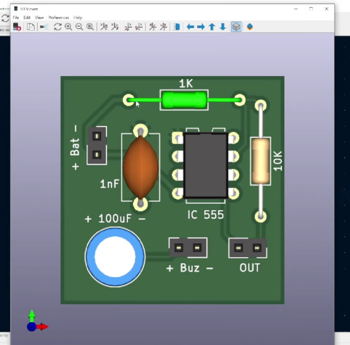

Queaky STEM toy circuit

## Description

The Squeaky STEM Toy Circuit is a simple interactive electronic toy built using the NE555 timer IC. The circuit generates a buzzer sound when the touch input is activated, demonstrating the fundamentals of timer circuits, touch sensing, and basic PCB design.

## Components Used
- NE555 Timer IC
- Resistors
- Capacitors
- Buzzer
- Battery

## What I Learned
- Schematic design
- 555 timer basics
- Touch input concept
- PCB workflow basics

## Schematic

## Footprint Assignment

Assigned appropriate PCB footprints to all schematic components before PCB generation.

### Purpose
Footprint assignment links schematic symbols to their real physical PCB dimensions, enabling accurate PCB layout generation.

## Net Class Configuration

Configured separate net classes for:
- Power traces
- Signal traces
- Output routing

This improves PCB organization and routing clarity.

## PCB Layout

Designed and routed the PCB for the touch-triggered 555 timer circuit.

### Features
- Compact PCB layout
- Through-hole components
- Organized component placement
- Clean routing design

## 3D PCB Preview

Generated a 3D visualization of the PCB to verify:
- Component placement
- PCB appearance
- Connector orientation

## Skills Learned
- Schematic creation
- Footprint assignment
- Net class configuration
- PCB routing
- PCB visualization using KiCad
- Basic PCB design workflow

