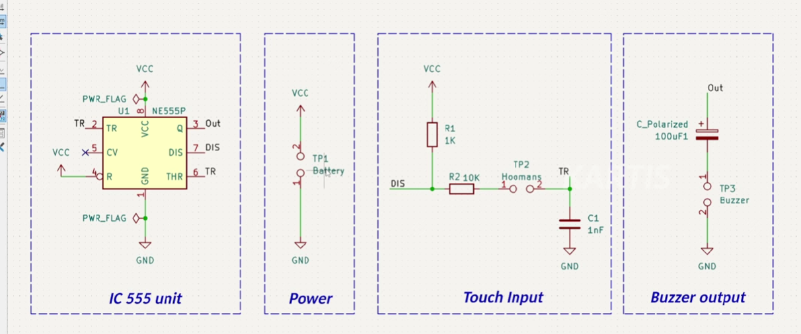
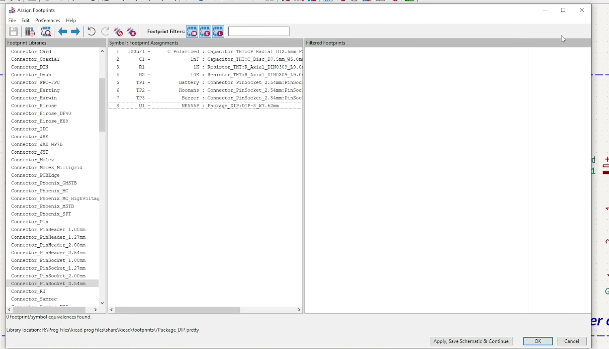
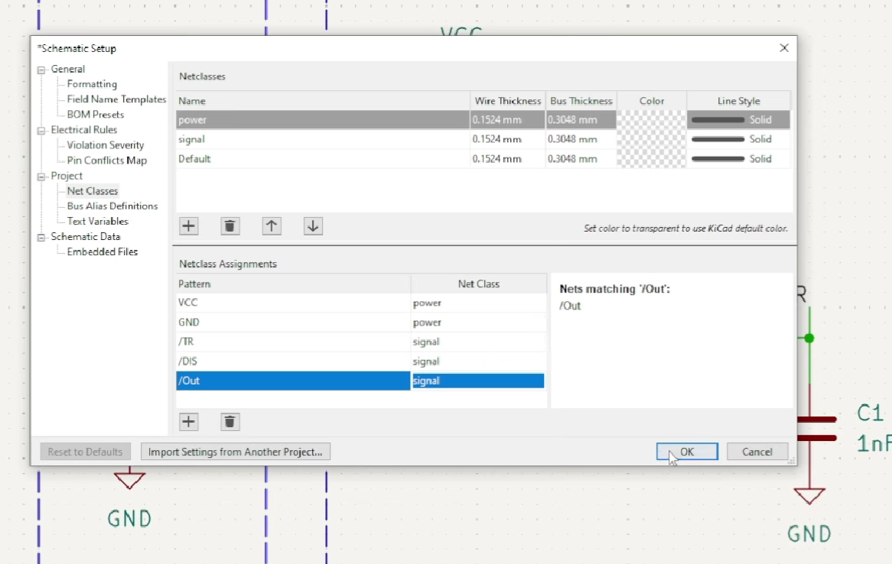
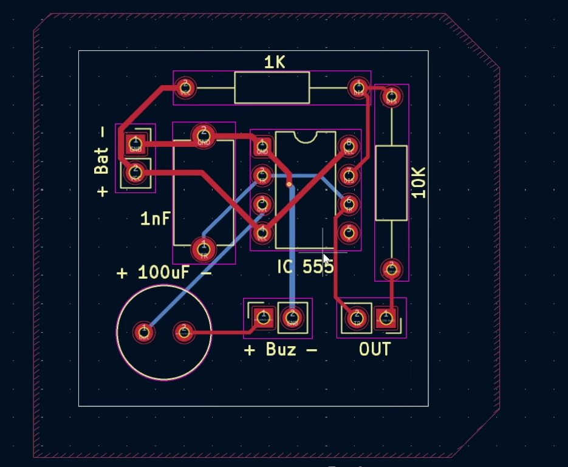

# Day 1 - Touch Sensor using 555 Timer

## Description
A simple touch-triggered buzzer circuit using the NE555 timer IC.

## Components Used
- NE555 Timer IC
- Resistors
- Capacitors
- Buzzer
- Battery

## What I Learned
- Schematic design
- 555 timer basics
- Touch input concept
- PCB workflow basics

## Schematic

## Footprint Assignment

Assigned appropriate PCB footprints to all schematic components before PCB generation.

### Purpose
Footprint assignment links schematic symbols to their real physical PCB dimensions, enabling accurate PCB layout generation.

## Net Class Configuration

Configured separate net classes for:
- Power traces
- Signal traces
- Output routing

This improves PCB organization and routing clarity.

## PCB Layout

Designed and routed the PCB for the touch-triggered 555 timer circuit.

### Features
- Compact PCB layout
- Through-hole components
- Organized component placement
- Clean routing design

